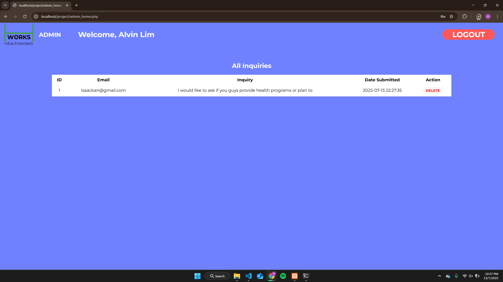

Healthworks is an assignment based project that we've develop for our Web Development subject. 
We were assigned to create multiple functions such as: Login, Register, Admin, php and SQL related functions.
It's a website that plans to spread awareness about the Sustainable Development Goals(SDG), and SDG 3 - Good Health and Well Being Specifically.

It utilises HTML5, PHP, CSS, and JAVASCRIPT 
To run it, it requires the XAMPP control panel with MySQL and Apache running.

<b>Login page function</b>

  
<b>Register page function</b>

  
<b>Home Page 1</b>

  
<b>Home Page 2</b>

  
<b>Home Page 3</b>

  
<b>Home Page 4</b>

Inquiry box on page 4 allows user to send feed back so it can be viewed on the admin page as shown below.
  
<b>About Us</b>

  
<b>Admin Side</b>

